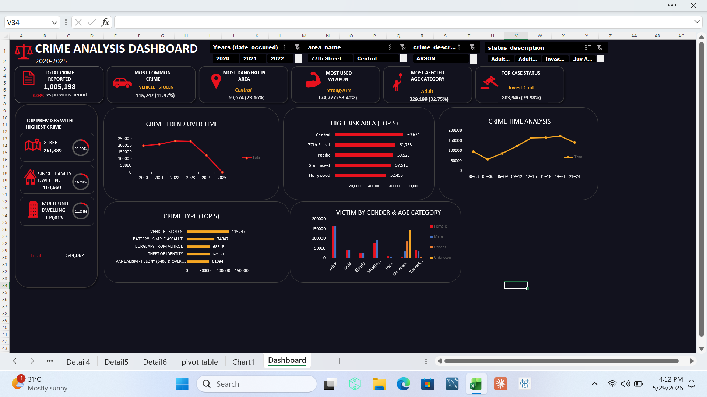

# Crime Analysis Dashboard

## Overview
Analysis of Los Angeles crime data (2020-2025) using SQL and Excel to uncover crime trends, high risk areas, victim patterns and case resolution insights.

## Tools Used
- MySQL — Data cleaning & Exploratory Data Analysis (EDA)
- Excel — Interactive dashboard & data visualization

## Key Insights
- Central and 77th Street are the highest risk areas in Los Angeles
- Vehicle theft and battery assault are the most common crime types
- The majority of open cases are still under active investigation
- Street locations account for the highest number of crime incidents

## Files
- crime_analysis.sql — Data cleaning and Exploratory Data Analysis

## Dashboard Preview

